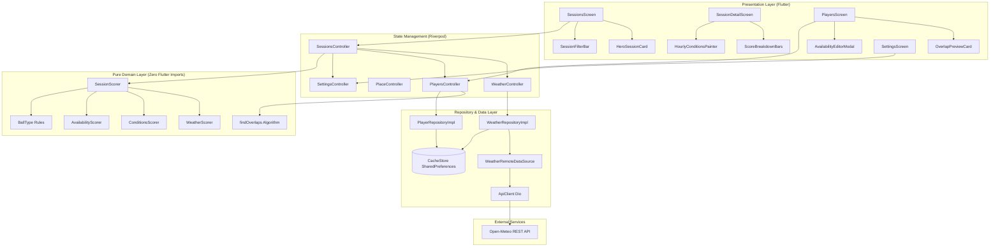

#Download Link
https://drive.google.com/file/d/1k57X_9fnmNfBPQFV3RoTu94l2dwHhSSM/view?usp=drive_link

# CricketMate 🏏 — Cricket Session Planner

> *"When should our group play cricket today?"*

CricketMate is a production-grade, offline-first Flutter application engineered for recreational and club cricket groups. It solves the perennial weekend dilemma by combining hyper-local **Open-Meteo weather forecasts** with **squad availability** to discover, rank, score, and share optimal playing sessions.

---

## 1. User & Problem

### The User
Cricket captains, club organizers, turf cricket enthusiasts, and casual weekend groups (gully, box, tennis-ball, and leather-ball players) responsible for assembling 6 to 11+ players for a match.

### The Problem
Coordinating a cricket match is a messy, multi-variable puzzle:
1. **Unpredictable Weather**: Rain probability alone doesn't tell the full story. Excessive heat exhaustion, high wind gusts affecting bowling trajectories and high catches, fading daylight, and slippery evening dew can ruin a game.
2. **Pitch & Ground Conditions**: Even if the rain stops, 12–24 hours of prior precipitation leaves a waterlogged, muddy outfield where leather balls become water-damaged and fast bowlers risk ankle injuries.
3. **Availability Coordination**: Group chats on WhatsApp devolve into endless polls, ambiguous commitments, and conflicting schedules.

CricketMate automates this decision-making process by computing a single, transparent **Session Score (0–100)** for every candidate window, identifying hard vetoes (such as thunderstorms or missing quorum), and generating a one-tap WhatsApp invite.

---

## 2. Why Open-Meteo?

CricketMate uses the [Open-Meteo Weather API](https://open-meteo.com/) as its meteorological backbone:
- **Zero API Keys & Zero Secrets**: Completely open and free for non-commercial use with no API tokens or keys to provision or leak.
- **Hourly Granularity**: Delivers precise hourly predictions for apparent temperature, precipitation probability, rain volume (mm), relative humidity, dew point, wind speed, wind gusts, and UV index.
- **Historical Prior Precipitation (`past_days=1`)**: Crucial for evaluating wet outfield and pitch recovery risk from rain that fell before the proposed session window.
- **Astronomical Calculations**: Provides sunrise and sunset timestamps to compute daylight duration, mandatory for leather-ball cricket safety.
- **Built-in Geocoding**: High-speed city and cricket ground name search out of the box.

---

## 3. The Original Feature

CricketMate’s signature feature is its **Intelligent Session Recommendation Engine**. Rather than simply checking if it will rain, it sweeps candidate time windows against both squad availability and a multi-factor cricket condition model—evaluating evening dew point depression, prior wet-outfield recovery, wind-induced ball drift, and ball-specific daylight constraints—instantly vetoing hazardous sessions and ranking viable ones into one-tap shareable WhatsApp match invites.

---

## 4. Environment & Tooling

Tested and verified against stable releases:
- **Flutter**: `3.47.5` (channel stable)
- **Dart**: `3.13.4`
- **Target Platforms**: Android, iOS, Web, macOS, Windows, Linux

---

## 5. Quickstart & Clean Clone Setup

CricketMate requires **no API keys, no `.env` files, and no external developer accounts**. Anyone can clone and run it immediately:

```bash
# 1. Clone the repository
git clone https://github.com/rohitnaik-dev/cricket_mate.git
cd cricket_mate

# 2. Install dependencies
flutter pub get

# 3. Generate strongly-typed localization bindings (English & Hindi)
flutter gen-l10n

# 4. Verify static analysis and code formatting
flutter analyze
dart format --set-exit-if-changed .

# 5. Run the complete test suite (154 tests)
flutter test --coverage

# 6. Launch the application
flutter run
```

---

## 6. Architecture & System Design

CricketMate follows a strict **Feature-First Architecture** with immutable unidirectional data flow and zero coupling between UI widgets and HTTP networking.

### Architectural Diagram



### Architectural Guardrails
1. **Pure Domain Isolation**: Everything in `lib/features/sessions/domain/` and `lib/features/players/domain/` is pure Dart with zero Flutter imports (`flutter/material.dart` etc.), making scoring algorithms 100% portable and lightning-fast to test.
2. **Network Separation**: Widgets never call HTTP or import `dio`. All remote calls route strictly: `RemoteDataSource` $\to$ `Repository` $\to$ `Riverpod Notifier` $\to$ `UI`.
3. **Exhaustive Sealed States**: Asynchronous states are modeled via the sealed hierarchy `ViewState<T>` (`ViewLoading`, `ViewSuccess`, `ViewEmpty`, `ViewFailure`) and handled via Dart 3 pattern matching switch expressions.

---

## 7. Package Dependencies & Justifications

Every third-party package introduced into CricketMate is justified in [`docs/PACKAGES.md`](docs/PACKAGES.md):

| Package | Classification | Justification |
|---|---|---|
| `flutter_riverpod` | Direct Dependency | Compile-safe, testable state management and dependency injection without `BuildContext` coupling. |
| `dio` | Direct Dependency | Robust HTTP client supporting connection timeouts, response parsing, and error mapping for Open-Meteo APIs. |
| `shared_preferences` | Direct Dependency | Lightweight persistent key-value storage for offline caching, app settings, and preferred cricket venue. |
| `intl` | Direct Dependency | Internationalization, localized date, time, and timestamp formatting for cricket session intervals. |
| `flutter_localizations` | SDK Dependency | Core Flutter SDK localization support for localized widgets, calendars, and date/time pickers. |
| `share_plus` | Direct Dependency | Cross-platform native system share sheet to invite cricket squad members via WhatsApp and messaging apps. |
| `flutter_lints` | Dev Dependency | Enforces official Flutter community and Dart team style and quality linting rules. |
| `mocktail` | Dev Dependency | Clean, null-safe mocking library for unit testing repositories, API clients, and Riverpod notifiers without code generation. |
| `flutter_test` | SDK Dev Dependency | Core Flutter SDK testing framework for widget and unit test verification. |

---

## 8. Scoring Formula & Cricket Reasoning

The overall session viability score $S \in [0, 100]$ is computed as:

$$S = 0.60 \times W + 0.30 \times A + 0.10 \times C$$

Where:
- $W$ = Weather Score
- $A$ = Squad Availability Score
- $C$ = Ground & Pitch Conditions Score

### 1. Weather Score ($W$) — Weight: 60%
- **Rain Risk (40%)**: Combines precipitation probability and expected precipitation amount (mm). In cricket, rain halts play immediately, makes the pitch unplayable, and ruins the seam of the ball.
- **Temperature Comfort (25%)**: Uses apparent temperature based on an optimal comfort bell curve centered at **20°C–28°C**. Below 12°C stiffens fingers and slows reaction times; above 36°C introduces severe dehydration and heat exhaustion risks.
- **Wind & Gusts (15%)**: Wind speeds $>30$ km/h or gusts $>45$ km/h alter bowling trajectory, induce unpredictable swing, and make skyed catches hazardous.
- **Humidity / Heat Index (10%)**: High relative humidity combined with heat impairs sweat evaporation, accelerating player fatigue and causing slippery hands.
- **UV Radiation (10%)**: Evaluates sunburn and glare danger during daytime hours (inactive during night/evening sessions).

### 2. Pitch & Ground Conditions Score ($C$) — Weight: 10%
- **Wet Outfield Risk**: Analyzes cumulative precipitation in the preceding 12–24 hours. A saturated outfield ruins leather balls within overs, prevents the ball from rolling, and leads to dangerous footing injuries for fielders and bowlers.
- **Evening Dew Risk**: Measures the gap between temperature and dew point in the late evening. When the gap narrows ($<2.5^\circ\text{C}$), dew condenses on the grass, making the cricket ball wet, heavy, and impossible for spin and pace bowlers to grip.
- **Daylight Coverage**:
  - **Leather Ball**: Requires 100% daylight coverage. Playing with a hard leather ball in twilight is dangerous and causes injuries.
  - **Tennis Ball & Box Cricket**: More tolerant of lower light and floodlights.

### 3. Squad Availability Score ($A$) — Weight: 30%
- Compares confirmed available squad members against the team quorum (configurable, default 6 players).

### 4. Hard Veto Rules (Score Capped at 30)
Regardless of the composite score, the session score is hard-capped at **30 (Unplayable / Vetoed)** if:
1. **Severe Weather**: Active thunderstorm or squall codes (WMO 95–99).
2. **Heavy Rain Risk**: Precipitation probability $>70\%$.
3. **Insufficient Players**: Attending players < squad quorum.

---

## 9. API Terms & Attribution Summary

- **Service**: [Open-Meteo](https://open-meteo.com/)
- **License**: Creative Commons Attribution 4.0 International ([CC BY 4.0](https://creativecommons.org/licenses/by/4.0/)).
- **Usage Limits**: Free for non-commercial and commercial use up to 10,000 API calls/day without requiring an API key.
- **In-App Compliance**: Displayed prominently in `SettingsScreen` and on `SessionDetailScreen`: *"Weather data by Open-Meteo.com"*.

---

## 10. Scope Cut & Future Roadmap

### What Was Cut for Scope
- **Direct Cloud Sync**: Avoided introducing external BaaS (Firebase/Supabase) to maintain zero-configuration clean clones without project IDs or cloud credentials.
- **Background Push Notifications**: Native background services and APNs/FCM were cut to keep the build lightweight and keyless.

### What Would Be Done Next
1. **Multi-User Realtime Availability**: A lightweight WebSockets / Supabase presence room allowing each squad member to mark their availability on their personal device.
2. **Push Notifications & 2-Hour Alerts**: Background weather monitor alerting the group 2 hours before match start if rain clouds roll in.
3. **Multi-Venue Comparison**: Side-by-side comparison of 2 or 3 nearby grounds or box turfs to select the driest venue.
4. **Custom Match Profiles**: Configurable formats (e.g., T20 3-hour, 10-over tape-ball 90m, 6-over gully 45m).

---

## 11. AI Usage Disclosure

In compliance with the project guidelines, AI assistance (Google DeepMind Antigravity / Claude) was utilized as an agentic pair-programmer for:
- Formulating mathematical models for cricket conditions (dew point depression curves, past-rain outfield saturation weights).
- Generating exhaustive unit and widget tests covering boundary times, overlap sweep edge cases, and provider overrides.
- Drafting initial localization ARB templates for English and Hindi.
- Code review, static analysis verification, and architecture validation.

All architectural decisions, layer separation, domain logic, and accessibility checks were audited, executed, and verified.

---

## 12. Development Time Log

A rough, breakdown of actual time spent developing CricketMate:

Setup, planning - 3h,
data layer - 2h,
UI-3h,
tests-manual in mobile test-2h,
bugFix-2h. 

Total - 12 hrs

## 📱 App Screenshots
| Light Mode | Dark Mode |
|:---:|:---:|
|  |  |